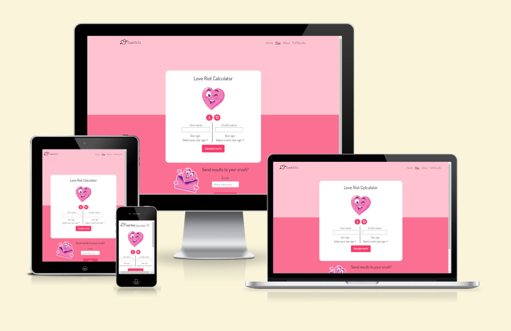

# Love Riot 💘 by Cupid&Co

## Intro

In the name of all things ***RoMaNcE*** this Valentine's February, The **Love Riot** web app showcases the **Love Compatibility Calculator**.
Based on zodiac star sign compatibility, users can calculate a potential compatibility score with their partner or crush and send the results on by email.

Compatibility scoring is displayed as a percentage match of the astrological star-signs of each person - adapted from [numerologysign.com](https://numerologysign.com/zodiac-signs-compatibility/)!

------

## Showcase

The **Am I Responsive?** link can be found here - [Am I Responsive?](https://ui.dev/amiresponsive?url=https://yamesjamess.github.io/feb-24-hackathon-love-riot/game.html)

A **deployed link** to the live website can be found here at [Love Riot](https://yamesjamess.github.io/feb-24-hackathon-love-riot/#)

---

# Site Goals

## Problem Statement

When it comes to the complexities of love and relationships, many people 'look to the stars' in order to analyse the potential of a budding romance between two people. We decided to build our Valentine's themed application as a Love Compatibility Calculator which is both fun to use and shares some insights into the compatibility of the astrological star-signs.

Our opening statement on the landing page for users:

***"Feeling lost in the maze of love? Wondering if you're on the right
path to happiness? Unveil the secrets of your relationships with
our Love Compatibility Calculator! Say goodbye to uncertainty and
hello to lasting connections."***

## Objectives

In the spirit of Valentine's day, our objective was to create a functioning love compatibility calculator game which displays a percentage compatibility score after the user has input two names and two zodiac star-signs.

### Target Audience

The target audience of this game is anyone interested in learning about astrological star-sign compatibility in romantic relationships. It can also be played as a light hearted game for all ages, especially around Valentine's Day, where the results can be forwarded to friends (or a crush) by email.

### User Requirements and Expectations

- Simple and intuitive user interface
- Explanation of how the site works is easy to understand
- Calulator game works as expected and is fun to play
- Clear presentation of the content
- Option to learn more about the page / access help with knowing which star-sign to choose
- Design that is visually attractive
- Accessibility
- Features and navigation system works as expected

### User Stories

As a user I would like:
- to understand what the app is about and how to use it.
- to calculate a love compatibility score using the interactive calculator on screen.
- to have access to more details of zodiac compatibility to complement the calculator results.
- for the animation and scoring to appear smoothly and accurately.
- to have some help with choosing the correct star sign for myself or my crush.
- to navigate through the elements of the game / website easily
- the option to access more information about the app and Cupid&Co.
- to enjoy the experience of using the site with a visually appealing format.

## Trade Offs

Considering the user requirements and expectations, the table below shows the features that should be implemented to make an appealing and functional interactive Love Calculator for users. Due to time constraints, some of these features are not implemented at this stage.

[X] indicates opportunities that were considered at the planning stage but were deemed not viable/feasible for this project sprint.
Y / N indicates a Yes / No as to whether each opportunity was acheived and implemented at this stage.

| Opportunity                                                                | Importance | Viability / Feasibility | Outcome |
| ---------------------------------------------------------------------------- | :--------: | :---------------------: | :------:|
| Love Calculator game grid for interactive compatibility scoring              |     5      |            5            |    Y    |
| About page for more information about the Cupid&Co Team                      |     4      |            5            |    Y    |
| Landing page (before starting the game)                                      |     4      |            5            |    Y    |
| Functioning user input form for game calculation                             |     5      |            5            |    Y    |
| Loading spinner during calculation process                                   |     4      |            5            |    Y    |
| Visual indicator of compatibility result                                     |     3      |            5            |    Y    |
| Info modal to give users guidance on selecting the correct star-sign         |     5      |            5            |    Y    |
| Reset option that clears the calculator form                                 |     5      |            5            |    Y    |
| Option to send results by email to a friend (via an email form)              |     4      |            5            |    Y    |
| Results page with descriptions of zodiac pair compatibility                  |     4      |            4            |    Y    |
| Pricing page for users to access extra brand services [X]                    |     3      |            2            |    X    |

### Features

- **Landing Page**

    - Landing page explains to the user what the site is about and invites them to play the calculator game via the 'play' button. Clicking the 'play' button opens the game grid.

    

- **Love Calculator Game Grid**

    -

    
     

- **Star-sign Select Tool**

    - 

    

- **Infographic modal (via the 'i' info button)**

    -

    

- **Send Results by Email**

    -

    
    

- **Results Page (zodiac compatibility details)**

    -

    
    

### Future Features

- Adding a horoscope API for generating detailed compatibility / prediction reports along with the results.
- Adding a pricing page for user to subscribe to our services such as reiki healing, cosmic realignment etc.

## Wireframes

Wireframes for the website were created using the UI wireframe tool, [Balsamiq](https://balsamiq.com/), to plan the layout with a mobile-first approach.

The layout and design was kept consistent across the pages / devices as much as possible.

**Mobile Device Love Calculator with pre-game layout (left) and results page layout (right)**:

**Note** - The square boxes with X inside was used to illustrate a decorative / animated image. And in the early planning stages we had not yet decided between using 'birthdate' or 'star-sign' user input.

## Compatibility Scoring

The JS logic used to calculate the percentage compatibility scores were based on the Zodiac Signs Compatibility page by [numerologysign.com] (https://numerologysign.com/zodiac-signs-compatibility/).

We initially decided on calculating our own scores based on a compatibility grid such as this one from [astrology-zodiac-signs](https://www.astrology-zodiac-signs.com/images/zodiac-signs-compatibility-chart.png):

However, we decided it was easier to calculate scores based on numerical data from a similar grid found at [numerologysigns.com](https://numerologysign.com/zodiac-signs-compatibility/):

The data for zodiac pairs was transcribed into a JS object (compatibilityData) which was then used in the calculation functionality of javascript.

To display different visuals associated with positive / negative scores, 'if/else' statements were run in the JS script depending on % brackets.

## Sending Results by Email

- EmailJS account was setup and linked to a custom Gmail account loveriot1402@gmail.com
- An HTML email template was created and uploaded into [EmailJS](https://www.emailjs.com).
- Images used in the email template are hosted on [AWS](https://aws.amazon.com/) for public accessibility

## Brand Identity

**Brand name and Logo options:**

The following details were decided as a Team:

Brand name: **Cupid&Co**

And app name: **Love Riot**

Logo image:

Logo with brand name (against pink website background):

**Colour palette:**

The following colour palette was created using [Coloors](https://coolors.co/) based on the theme of 'love' :

The following set of [Flaticon](https://www.flaticon.com/) stickers were then found which aligned well with the pink theme (see Credits for attribution):

## Tools and Technologies

1. HTML,
2. CSS,
3. Javascript,
4. Bootstrap,

- [GitHub and Github Pages](https://github.com/) - used to securely store the code and to host and deploy the live project
- [GitPod](https://www.gitpod.io/) - used as a cloud-based IDE for development
- [Chrome Developer Tools](https://developer.chrome.com/docs/devtools/) - used for testing and troublshooting code, along with Lighthouse auditing
- [Balsamiq](https://balsamiq.com/wireframes/) - used to create wireframes during project planning
- [Cloud Convert](https://cloudconvert.com/) - used for resizing and converting image files to webp format
- [Coolors](https://coolors.co/) - used to generate a color palette for the website design
- [Google Fonts](https://fonts.google.com/specimen/Dosis) - used to generate a visually appealing font
- [The Noun Project](https://thenounproject.com) - used for generating the logo icon
- [Flaticon](https://www.flaticon.com) - used to generate love-themed stickers
- [ChatGPT](https://chat.openai.com/) - used to help research javascript logic and for general coding queries
- [Canva](http://canva.com) - used for creating graphics, banners etc
- [Amazon Web Services](https://aws.amazon.com/) - for cloud hosting the email template images
- [EmailJS](https://www.emailjs.com) - email sending framework used to email results from the page

- [beautifytools](https://beautifytools.com/) - used for beautifying code
- [JSHint](https://jshint.com/) - used to validate JS code
- [Esprima](https://esprima.org/demo/validate.html) - used to validate JS syntax
- [W3 HTML validator](https://validator.w3.org/nu/) - used to validate HTML
- [W3 Jigsaw](https://jigsaw.w3.org/css-validator/validator) - used to validate CSS
- [AmIResponsive?](https://ui.dev/amiresponsive) - used to create a mockup of the website

You can access our project on GitHub [here](https://yamesjamess.github.io/feb-24-hackathon-love-riot/#)

## Testing:

For all testing, please refer to the [TESTING.md](TESTING.md) file.

## Deployment:

The site was deployed to GitHub Pages. The steps to deploy are as follows:
- In the [GitHub repository](https://github.com/yamesjamess/feb-24-hackathon-love-riot), navigate to the Settings tab.
- In the general settings side menu, open **Pages**.
- From the source section drop-down menu, select **Deploy from a branch** and then **Main** Branch, and click "Save".
- The page will be automatically refreshed with a detailed ribbon display to indicate the successful deployment and link to visit the site.

The live link can be found [here](https://yamesjamess.github.io/feb-24-hackathon-love-riot)

### Local Deployment

This project can be cloned or forked in order to make a local copy on your own system.

#### Cloning

You can clone the repository by following these steps:

1. Go to the [GitHub repository](https://github.com/yamesjamess/feb-24-hackathon-love-riot) 
2. Locate the Code button above the list of files and click it 
3. Select if you prefer to clone using HTTPS, SSH, or GitHub CLI and click the copy button to copy the URL to your clipboard
4. Open Git Bash or Terminal
5. Change the current working directory to the one where you want the cloned directory
6. In your IDE Terminal, type the following command to clone my repository:
	- `git clone https://github.com/yamesjamess/feb-24-hackathon-love-riot.git`
7. Press Enter to create your local clone.

Alternatively, if using Gitpod, you can click below to create your own workspace using this repository.

Please note that in order to directly open the project in Gitpod, you need to have the browser extension installed.
A tutorial on how to do that can be found [here](https://www.gitpod.io/docs/configure/user-settings/browser-extension).

## Known Issues

## Credits
The following media resources were used:
- [Logo (Cupid icon) generated from The Noun Project](https://thenounproject.com/icon/cupid-5981148/)
- [CSS Scan](https://getcssscan.com/css-buttons-examples) - CSS button by 'Duolingo'
- [HTML-shark](https://html-shark.com/HTML/Zodiac.htm) - used for zodiac symbols / emojis
- [zodiacsign](https://www.zodiacsign.com/compatibility) - used for compatibility content
- [Flaticon stickers](https://www.flaticon.com/free-stickers/love) created by [MrHamster](https://www.flaticon.com/authors/mrhamster?type=sticker)
- [numerologysign.com](https://numerologysign.com/wp-content/uploads/2020/09/Zodiac-Signs-List-with-Dates-Symbols-1920x1681.png) star-sign inforgraphic:
    

The Cupid & Co Team:
- [Ilyas Olgun](https://github.com/ilyasolgun11)
- [James Kasetarapanya](https://github.com/yamesjamess)
- [Meghan Roberts](https://github.com/MeganRoberts-dev)
- [Melissa Buckingham](https://github.com/MelissaBuckingham)
- [Russ Smith](https://github.com/rstan-dev)
- [Tarah Waters](https://github.com/tarahwaters)